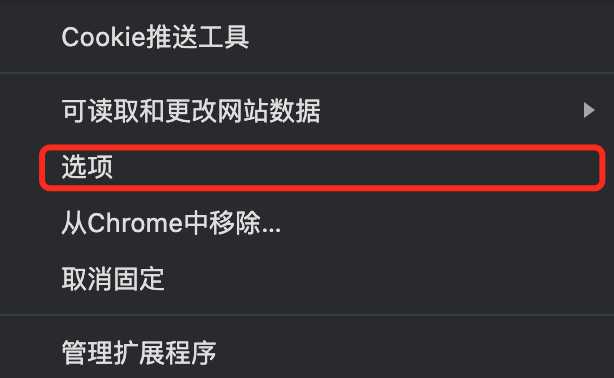
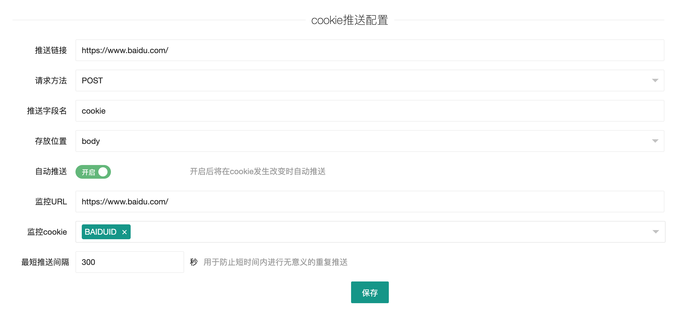
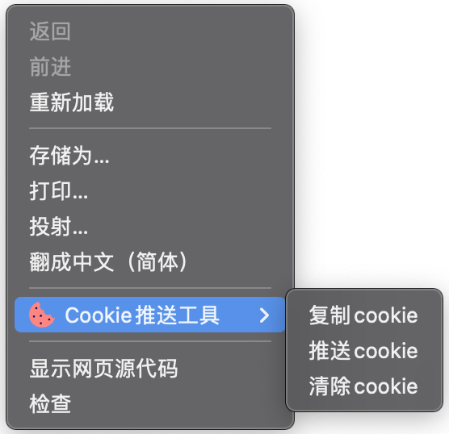

# Cookie推送工具 

使用全新的MV3（Manifest V3）开发的Chrome扩展程序，用于提取网站的Cookie，推送到服务器。

方便用于爬取一些登录验证方式比较难破解的网站，直接浏览器端登录，服务器接收cookie即可。

> 如果此项目对您有所帮助，还希望能够 Star 支持一下，您的点赞就是我维护的动力！

### 功能特点
* 自定义服务器地址
* 将Cookie上传至服务器
* 将Cookie拷贝至剪切板
* 一键清空当前页面下的Cookie
* 监控Cookie变化，在Cookie发生改变时自动推送

### 安装

* chrome浏览器，设置 --> 更多工具 --> 扩展程序
* 勾选开发者模式
* 选择加载已解压的扩展程序，选择clone下来的`cookie-push`目录

### 使用

* 点击浏览器“Cookies提取助手”扩展程序按钮，选择选项，进入配置界面
* 填写API等相关信息

  #### 手动推送

  - 在需要推送cookie的页面点击鼠标右键
  - 选择“Cookies推送工具”
  - 选择"推送cookie"

  #### Cookie监控

  - 进入配置界面
  - 打开自动推送
  - 填写需要监控的URL和Cookie并保存

### 配置项介绍

* 推送链接: 用于接收cookie的接口地址
* 请求方法: HTTP 请求方法
* 推送字段名: 服务器用于接收Cookie的字段名称
* 存放位置: Cookie数据的存放位置
* 自动推送: 是否开启自动推送功能
* 监控URL: 需要监控的URL(同网站下的任意URL均可)
* 监控Cookie: 需要监控的Cookie的名称，只有在监控列表中的Cookie发生改变时才会推送(**只要重新设置了Cookie，哪怕值与原先一致,也会被监听到**)
* 最短推送间隔: 两次推送的时间间隔，浏览器可能一次性设置了很多Cookie，每设置一次都会被监听到，用于防止向服务器发送过多无意义的请求

### 相关截图

